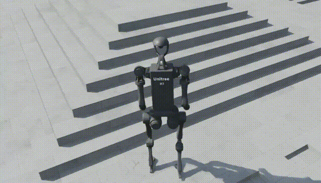
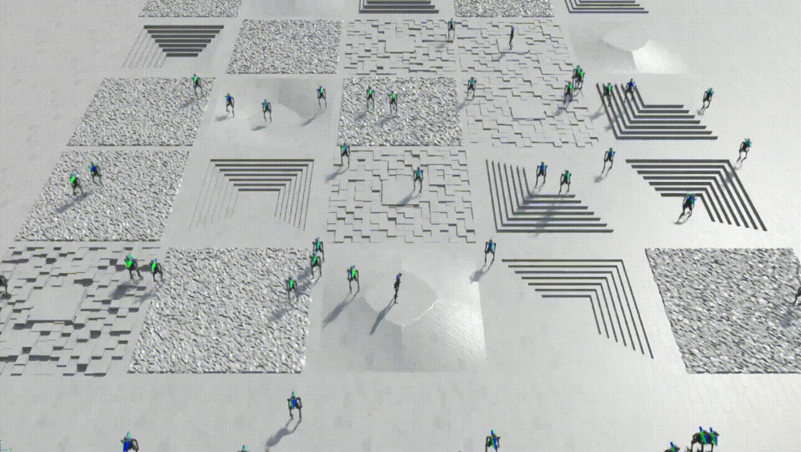
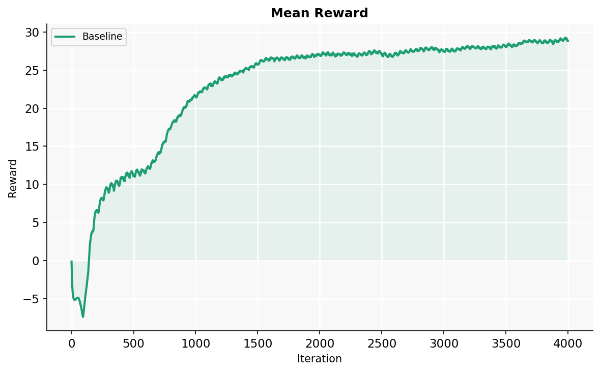
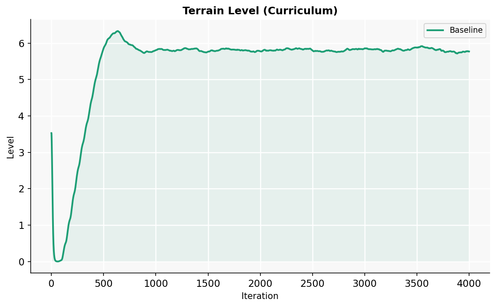
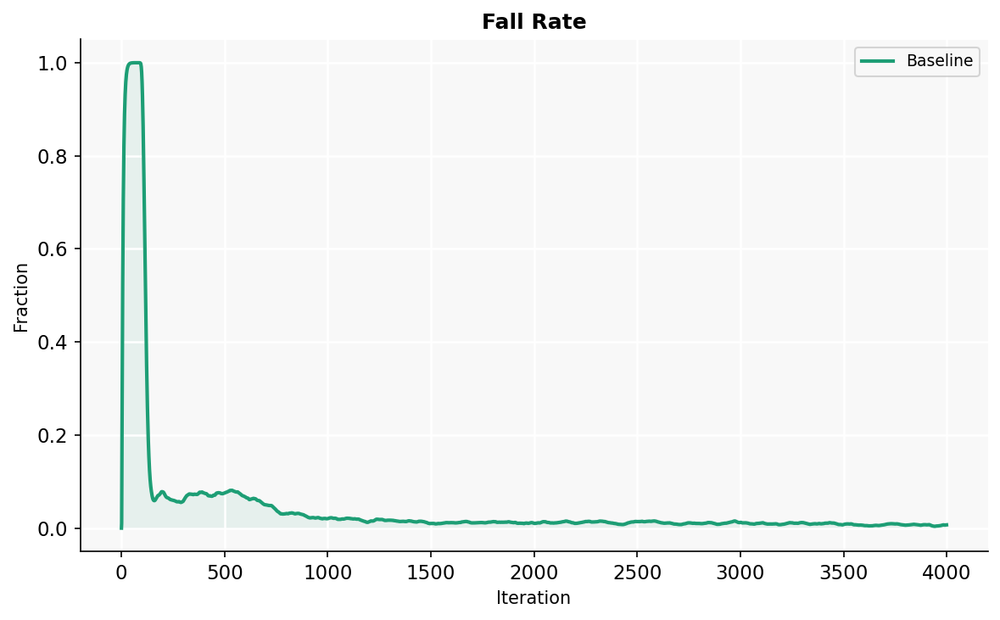

# Unitree H1 Humanoid Locomotion in Isaac Lab

<p align="center"><b>Keyboard-controlled H1 humanoid navigating rough terrain (follow camera)</b></p>
<p align="center"></p>

<p align="center"><b>50 environments trained simultaneously (top view)</b></p>
<p align="center"></p>

Training a PPO locomotion policy for the [Unitree H1](https://www.unitree.com/h1/) humanoid robot in [Isaac Lab](https://isaac-sim.github.io/IsaacLab/) on rough terrain using 4096 parallel environments. This project is a companion to the [Quadruped Locomotion with Domain Randomization](https://github.com/egeozgul/quadruped-locomotion-isaaclab) project, extending the same PPO + terrain curriculum framework to bipedal locomotion.

---

## Results

| Metric | Value |
|--------|-------|
| Final mean reward | **28.58** |
| Final episode length | **992 steps** |
| Terrain level reached | **5.76 / 8** |
| Velocity tracking error | 0.24 m/s |
| Fall rate | **0.74%** |
| Survival rate (time-out) | **99.26%** |
| Total timesteps | 393M |
| Training time | ~1h 14min |
| Parallel environments | 4096 |
| Iterations | 4000 |

---

## Training Curves

**Mean Reward**



**Terrain Level (Curriculum)**



**Fall Rate**




---

## Comparison with Quadruped (Anymal C)

Training both quadruped and humanoid locomotion policies with the same Isaac Lab framework reveals key differences between bipedal and quadrupedal locomotion:

| Metric | Anymal C (Quadruped) | H1 (Humanoid) |
|--------|---------------------|---------------|
| Final reward | 16.30 | **28.58** |
| Fall rate | 16% | **0.74%** |
| Terrain level | 5.98 / 8 | 5.76 / 8 |
| Velocity tracking error | 0.33 m/s | **0.24 m/s** |
| Episode survival | 84% | **99.26%** |

The H1 policy achieves significantly higher reward and lower fall rate than the Anymal C baseline. This is largely due to the H1 config having a richer reward function (14 terms vs 11) including a large termination penalty (-200), feet slide penalty, and joint deviation terms that collectively produce more stable and efficient locomotion. The quadruped reaches a slightly higher terrain curriculum level (5.98 vs 5.76), consistent with the inherent stability advantage of four-legged locomotion.

---

## Reward Structure

The H1 config uses 14 reward terms designed for bipedal stability:

| Term | Weight | Purpose |
|------|--------|---------|
| track_lin_vel_xy_exp | 1.0 | Forward/lateral velocity tracking |
| track_ang_vel_z_exp | 1.0 | Yaw rate tracking |
| termination_penalty | -200.0 | Strong fall discouragement |
| flat_orientation_l2 | -1.0 | Upright posture |
| feet_slide | -0.25 | Stable foot contact |
| joint_deviation_hip | -0.2 | Natural hip posture |
| joint_deviation_arms | -0.2 | Natural arm posture |
| dof_pos_limits | -1.0 | Joint limit avoidance |

---

## Setup

This project requires [Isaac Lab](https://isaac-sim.github.io/IsaacLab/) with Isaac Sim 5.0.

**Train:**
```bash
./isaaclab.sh -p scripts/reinforcement_learning/rsl_rl/train.py \
    --task=Isaac-Velocity-Rough-H1-v0 \
    --num_envs=4096 --headless --max_iterations=4000
```

**Play (25 environments):**
```bash
./isaaclab.sh -p scripts/reinforcement_learning/rsl_rl/play.py \
    --task=Isaac-Velocity-Rough-H1-Play-v0 \
    --num_envs=25 \
    --checkpoint logs/rsl_rl/h1_rough/<run_dir>/model_3999.pt
```

---

## Environment

- Isaac Lab 0.45.9 / Isaac Sim 5.0
- PyTorch 2.7.0 + CUDA 12.8
- RSL-RL 2.3.3 (PPO)
- GPU: NVIDIA RTX 5070 Ti (12 GB)
- Training time: ~1h 14min at 4096 parallel environments
